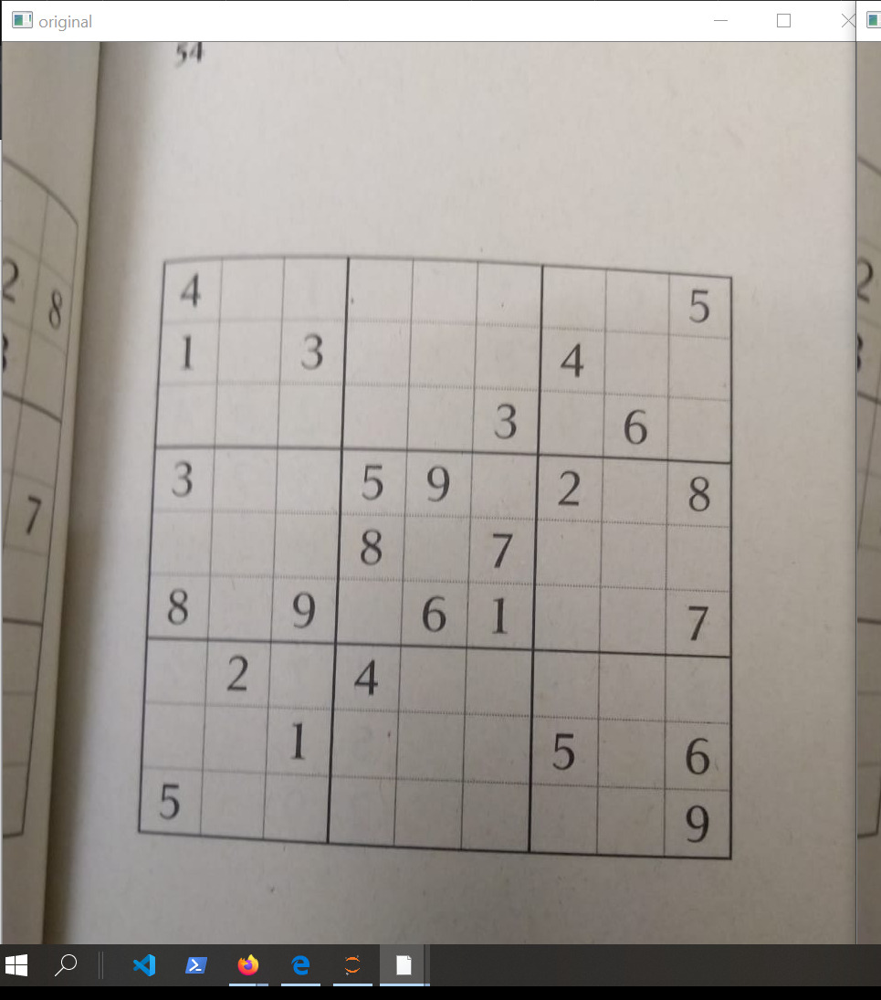
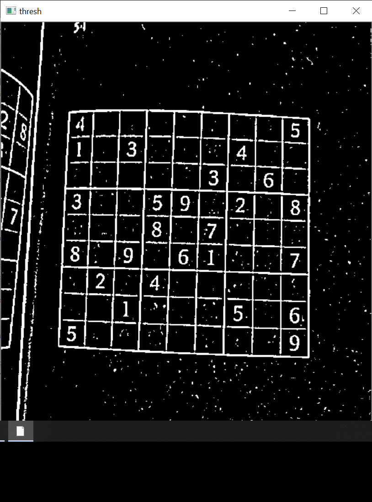
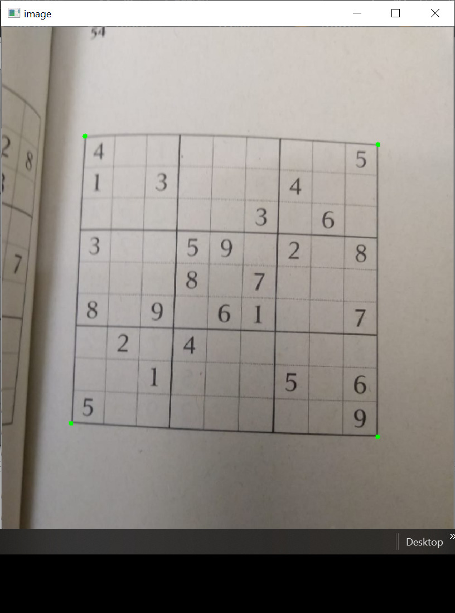
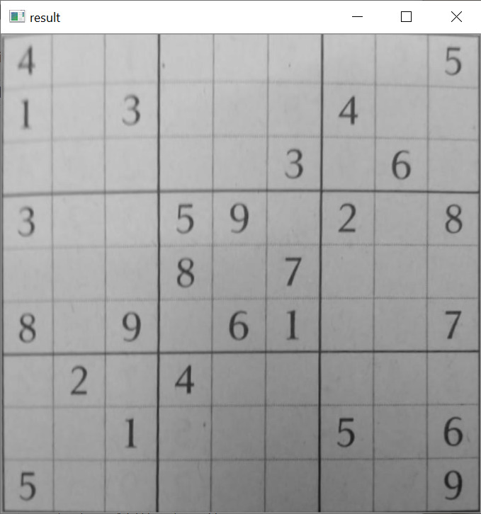
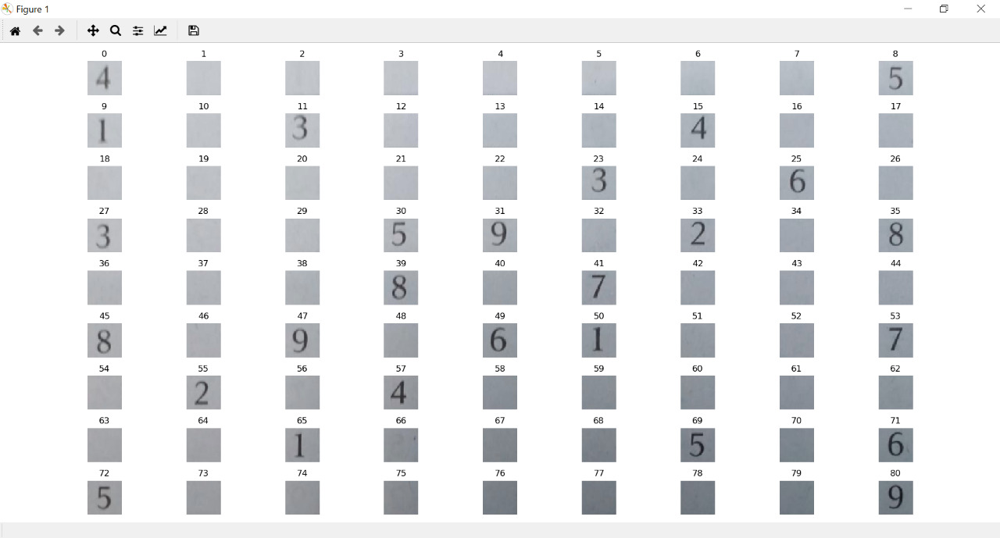
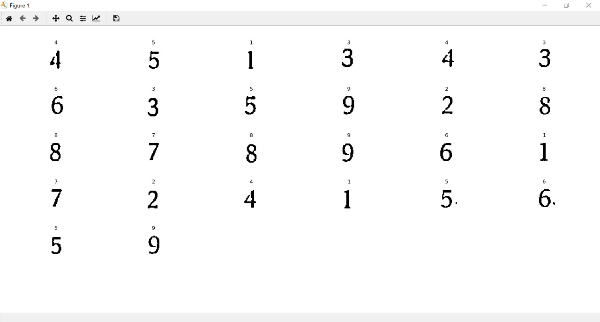
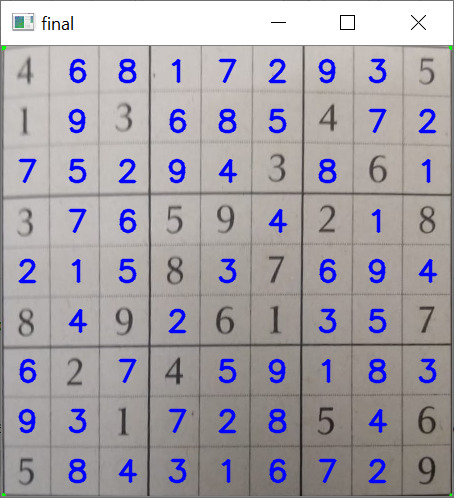

# Sudoku-Solver
This project extracts sudoku grid from an image and solves it using backtracking.

#### Step 1:
Read the image, apply Gaussian blurring to preserve the edges while reducing the noise in the image. These edges can then be _detected_ by using adaptive thresholding (A step which coverts a grayscale image to binary image i.e only black and white pixels)

  

#### Step 2:
Using cv.findContours method find the contours (these are the lines joining all the points along the boundary of an image that have the same intensity). Then loop through these contours and find the largest rectangle-shape contour. These corner points are then used to warp the image to a square of 450x450 (using cv.getPerspectiveTransform and cv.warpPerspective).

 

#### Step 3:
Since the image is warped to a fixed 450x450 dimension each of the squares would measure 50x50 (450/9). Extract these squares and store them in a list.

#### Step 4:
To extract the digits check the __centre__ of the extracted and thresholded 81 squares. If the __centre__ contains white pixels that exceed a certain limit, then we can infer that these squares contain digits. Store these digits in a separate list along with their indices. These digits can then be detected using a neural network (Trained on a subset of Chars74K dataset).

#### Step 5:
These recognised digits along with their indices are used to build the grid. This grid is then solved using bactracking algorithm (Check sudoku_solver.py for more info on this).

#### Step 6:
The solved grid is then traversed and the numbers are then written onto the warped image using cv.putText method. _Reverse warp_ the image to obtain original image with solved sudoku on it!

 
